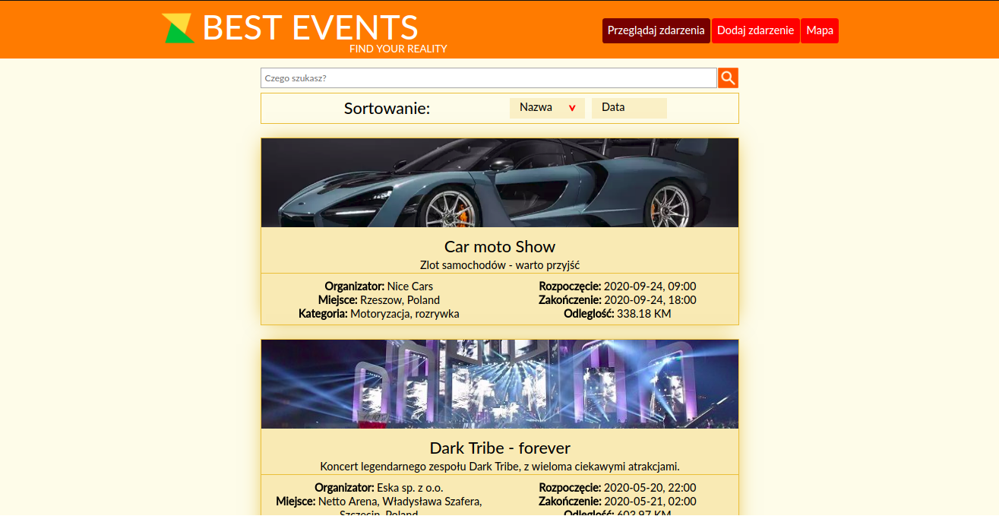
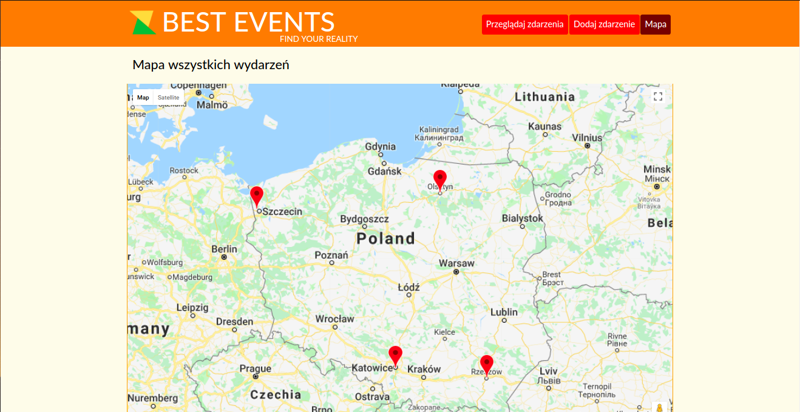

# Events_manager

Events-manager is a tool used to browse and manage events happening anywhere/anytime. You can access this app directly
thanks to github pages here: https://kamilpszczolkowski.github.io/events-manager-react-redux/

# General description

Application allows users to browse through events existing in database. Every event has specific data stored:

- name of event,
- place,
- date (start and end time),
- short description,
- full description,
- image URL,
- organisation,
- type of event,
- google maps coordinates and placeID.

Additionally user sees the distance between him and the specific event.

Users can browse through events by two ways:

- list of events, which can be sorted by name and date of events, filtered by the search filed.
- by the map - every event has marker on it. When user clicks on it, the popup with event data is shown. It can also be
  clicked to redirect to the event full description site.

When user is on the specific event site, there is option to edit event - all data can be rewritten. The second option is
to delete event.

# Purpose and technology

## JavaScript React

My purpose of this app was to create my first project showcasing JavaScript React technology. Site is entirely built with
react components - it only reloads parts of the site which change, not the entire site, as in traditional project.

Main views are handled by react router - change in page url forces react to render different components in main section
(header and footer remains unchanged). It works in the way shown below:

- url ends with '/' - main site showing the field to search through events,
- url ends with '/events' - site with all events shown as the list,
- url ends with '/events/_eventID_ - site with specific event description,
- url ends with '/addevents' - site with event creator,
- url ends with '/map' - site with map showing all markers of events stored in database.

## Redux

Redux was used to create a global store for application - data essential to the project is stored in there. This
approach allows to get any data we want in every place of application. Redux state is immutable - only reducers can
change data dispatched with specific ations. Dataflow in application has only one direction - typical for flux 
architecture.

## Webpack, ECMAScript

My development environment is based on Webpack. My configuration allows to:

- use newest ECMAScript functionality without the risk of not supporting older browsers (babel loader),
- process sass code to css format,
- test project with dev-server which allowed me to see instant changes in page after saving the file,
- build the whole page in separate folder which is ready to deploy on the server.

## Sass

For easier and cleaner css code I used Sass compiler. Files are separated in familliar way as components are.

## Firebase, Google maps/places API

For better functionality, external API's were used. Site is communicating with them by using fetch services.

For permanent data storage Firebase realtime database API is used. Events are stored in JSON format.
Every time event is added/modified/deleted - specific fetch service is updating data on the server.

It was important to show specific location for every event - that's where google maps API comes in hand.
I used it to allow users to mark the positions of newly added events (places API was used additionally for autocomplete
functionality).

Google geolocation service was used to calculate the distance between user and the event.

## RWD

Page is fully responsive, there should be no troubles in accessing it on any device. Media queries in css changes
page layout accordingly to the device viewport size.

# File structure

Project has specific file strcuture listed below:

- Docs - contains last site build ready to deploy on the server - this folder is used by gitHub pages to display
working project,
- images - images necessary in development process.
- scss - all styles applied in the project. For now I know this approach is not the best one in react (it's better to
separate files basing on components, not entire sections of the site). I'll try to change that in the future.
- src - code used in development process - it contains every component and whole redux store.

## SRC folder structure

Source folder structure will be listed below:
- components - contains all components which are not connected directly to Redux. These components create parts of the
site and are called by containers components. Components from this folder contains mostly redner functions and some 
basic display logic.,
- containers - main components conneceted to the redux store. These components pull necessary data and pass it to the
lower components.
- services - folder with functions handling external API interfaces.
- store - all files related to Redux. They are separated by domain: (eventForm, events, filters, singleEvent). Every
domain has it's actions file with action creators, actionType file with action types and reducer.js with reducer handling
dispatched actions and selectors - functions which exports data from the store to the components. Store folder contains
files with most important application logic and data.

# Installation

If you want to run/develop the code, you need to recreate the development environment based on package.json file - you
need to install the components listed in there (by using npm install in bash console in project folder). To run the site
you need to compile jsx files into out.js - it can be done in one of two ways:

- use dev-server - use command "npm run start" in bash console, it will start the server locally with preprocessed js and
  sass code.
- build the site - use command "npm run build" in bash console. The entire site will be built in docs folder.

# Remarks

Site is still in development process. Few bugs can be encountered:

- after deleting the event, automatic redirection accurs. In github pages page not found (404) sometimes occurs.

## Future uptades!

I'm going to develop few more functions for this project:

- Login functionality - I'm going to use Firebase authentication option to allow users to log in by facebook/google account.
  Every user can add, modify and delete only his events.
- Image hosting service - I want to use external API to create easy image hosting (Imgur/Firebase data storage). User
  could import a picture from the browsing device to the events. 
